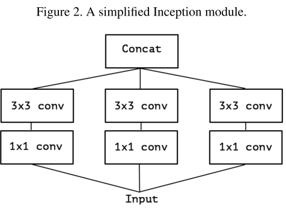
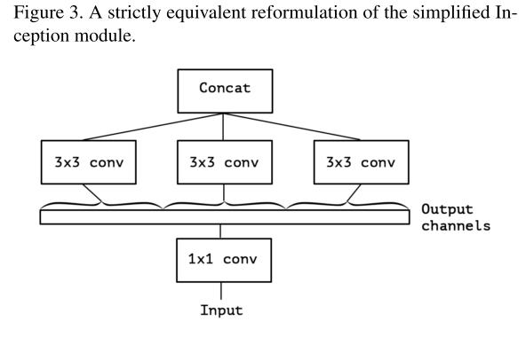
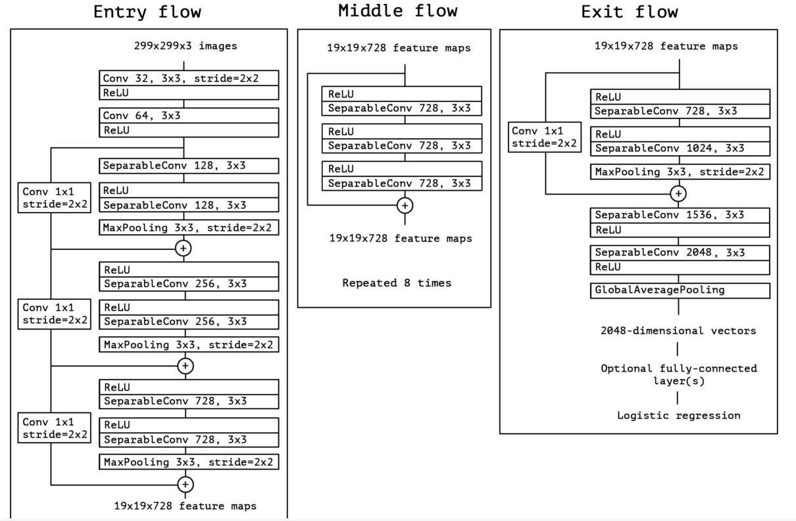
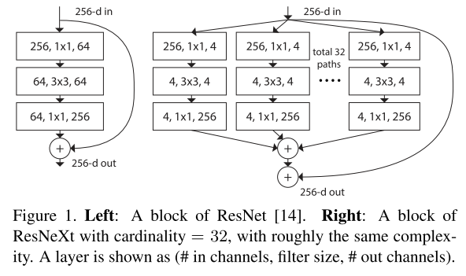
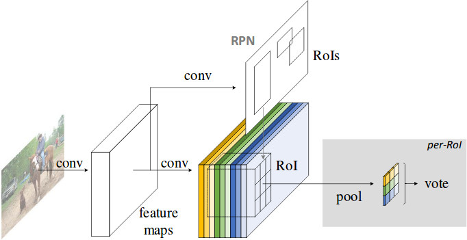
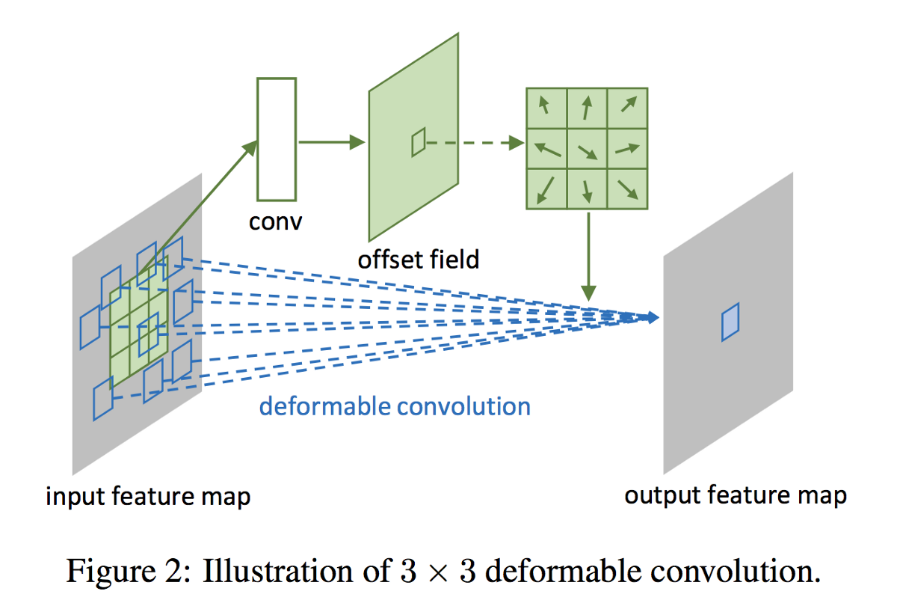

# （三）目标检测新趋势之基础网络结构演进、分类与定位的权衡

从此篇开始，我们对近几年检测领域的工作做一些介绍，并试图从中归纳出一些趋势。本篇关注基础网络架构的演进和处理分类、定位这一矛盾问题上的进展。

## 基础网络结构的演进

基础网络（Backbone network）作为特征提取器，对检测模型的性能有着至关重要的影响。每年的ILSRVC都会推动大批优秀网络结构的出现，在分类任务上表现出色的结构被引入到检测领域，常常也能取得正向的表现。

### 卷积网络结构演进的趋势

笔者认为，卷积网络已经有如下几个经典的设计范式：

- Repeat. 由AlexNet和VGG等开拓，几乎被之后所有的网络采用。即堆叠相同的拓扑结构，整个网络成为模块化的结构。
- Multi-path. 由Inception系列发扬，将前一层的输入分割到不同的路径上进行变换，最后拼接结果。
- Skip-connection. 最初出现于Highway Network，由ResNet发扬并成为标配。即建立浅层信息与深层信息的传递通道，改变原有的单一线性结构。

以这些范式为脉络整理卷积网络的演进历程，可以归纳出下面的图景：

需要说明的是，上图并不能概括完全近年来卷积网络的进步，各分支之间也有很多相互借鉴和共通的特征，而致力于精简网络结构的工作如SqueezeNet等则没有出现。

另外一个重要的潮流是深度可分离卷积（Depth-wise seperable convolution）的应用。在下面几个小节，我们对几个经典的结构做一些介绍。

### ResNet

[Deep Residual Learning for Image Recognition](http://arxiv.org/abs/1512.03385)

作者将网络的训练解释为对某一复杂函数的拟合，通过添加跳跃连接，变对这一函数的拟合为对残差的拟合，引入的恒等项也让BP得到的梯度更为稳定。

残差网络以skip-connection的设计较为成功地缓解了深层网络难以收敛的问题，将网络的深度提高了一个数量级，也带动了一系列对残差网络的解释研究和衍生网络的提出。

在检测领域，原来的VGG也逐渐被ResNet系列网络替代，文章中以ResNet作为基础网络的Faster R-CNN也常作为后续工作的基线进行比较。

### Xception

[Xception: Deep Learning with Depthwise Separable Convolutions](https://arxiv.org/abs/1610.02357)

Xception网络可以看做对Inception系列网络的推进，也是深度可分离卷积的成功应用。

文章指出，Inception单元背后的假设是跨Channel和跨空间的相关性可以充分解耦，类似的还有长度和高度方向上的卷积结构（在Inception-v3里的3×3卷积被1×3和3×1卷积替代）。

进一步的，Xception基于更强的假设：跨channel和跨空间的相关性完全解耦。这也是深度可分离卷积所建模的理念。

一个简化的Inception单元：

等价于：

将channel的group推向极端，即每个channel都由独立的3×3卷积处理：

这样就得到了深度可分离卷积。

Xception最终的网络结构如下，简单讲是线性堆叠的Depthwise Separable卷积，并附加了Skip-connection。

在MS COCO Chanllege 2017中，MSRA团队以对齐版本的Xception为基础网络取得前列的成绩，一定程度上说明了这一网络提取特征的能力。

### ResNeXt

[Aggregated Residual Transformations for Deep Neural Networks](https://arxiv.org/abs/1611.05431)

本文提出了深度网络的新维度，除了深度、宽度（Channel数）外，作者将在某一层并行transform的路径数提取为第三维度，称为"cardinality"。跟Inception单元不同的是，这些并行路径均共享同一拓扑结构，而非精心设计的卷积核并联。除了并行相同的路径外，也添加了层与层间的shortcut connection。

相比Inception-ResNet，ResNeXt相当于将其Inception Module的每条路径规范化了，并将规范后的路径数目作为新的超参数。

上图中，路径被扩展为多条，而每条路径的宽度（channel数）也变窄了（64->4）。

在近期Facebook开源的Detectron框架中，ResNeXt作为Mask R-CNN的基础网络也取得了非常高的精度。

### SENet

[Squeeze and Excitation Network](https://arxiv.org/abs/1709.01507)

SENet是最后一届ImageNet Challenge的夺冠架构，中心思想是添加旁路为channel之间的相关性进行建模，可以认为是channel维度的attention。

SENet通过‘特征重标定’（Feature Recalibration）来完成channel层面的注意力机制。具体地，先通过Squeeze操作将特征的空间性压缩掉，仅保留channel维度，再通过Excitation操作为每个特征通道生成一个权重，用于显式地建模channel之间的相关性，最后通过Reweight操作将权重加权到原来的channel上，即构成不同channel间重标定。

SENet可以作为网络中模块间的额外连接附属到原有的经典结构上，其Squeeze操作在压缩信息的同时也降低了这一附属连接的开销。

## 分类与定位问题的权衡

从R-CNN开始，检测模型常采用分类任务上表现最好的卷积网络作为基础网络提取特征，在其基础上添加额外的头部结构来实现检测功能。然而，分类和检测所面向的场景不尽相同：分类常常关注具有整体语义的图像，而检测则需要区分前景和背景。

分类网络中的Pooling层操作常常会引入平移不变性等使得整体语义的理解更加鲁棒，而在检测任务中我们则需要位置敏感的模型来保证预测位置的精确性，这就产生了分类和定位两个任务间的矛盾。

### R-FCN

[R-FCN: Object Detection via Region-based Fully Convolutinal Networks](https://arxiv.org/abs/1605.06409)

文章指出了检测任务之前的框架存在不自然的设计，即全卷积的特征提取部分+全连接的分类器，而表现最好的图像分类器都是全卷积的结构（ResNet等）。这篇文章提出采用“位置敏感分数图”的方法来使检测网络保持全卷积结构的同时又拥有位置感知能力。

位置敏感分数图的生成有两个重要操作，一是生成更“厚”的feature map，二是在RoI Pooling时选择性地输入feature map。

Faster R-CNN中，经过RPN得到RoI，转化成分类任务，还加入了一定量的卷积操作（ResNet中的conv5部分），而这一部分卷积操作是不能共享的。R-FCN则着眼于全卷积结构，利用卷积操作在Channel这一维度上的自由性，赋予其位置敏感的意义。下面是具体的操作：

- 在全卷积网络的最后一层，生成k^2(C+1)个Channel的Feature map，其中C为类别数，k^2代表k×k网格，用于分别检测目标物体的k×k个部分。即是用不同channel的feature map代表物体的不同局部（如左上部分，右下部分）。

- 将RPN网络得到的Proposal映射到上一步得到的feature map（厚度为k×k×(C+1)，）后，相应的，将RoI等分为k×k个bin，对第(i,j)个bin，仅考虑对应(i,j)位置的(C+1)个feature map，进行如下计算：其中(x0,y0)是这个RoI的锚点，得到的即是(i,j)号bin对C类别的相应分数。

- 经过上一步，每个RoI得到的结果是k^2(C+1)大小的分数张量，k×k编码着物体的局部分数信息，进行vote（平均）后得到(C+1)维的分数向量，再接入softmax得到每一类的概率。

上面第二步操作中“仅选取第(i, j)号feature map”是位置信息产生意义的关键。

这样设计的网络结构，所有可学习的参数都分布在可共享的卷积层，因而在训练和测试性能上均有提升。

#### 小结
R-FCN是对Faster R-CNN结构上的改进，部分地解决了位置不变性和位置敏感性的矛盾。通过最大化地共享卷积参数，使得在精度相当的情况下训练和测试效率都有了很大的提升。

### Deformable Convolution Networks

[Deformable Convolution Networks](https://arxiv.org/abs/1703.06211)

本篇文章则提出在卷积和RoI Pooling两个层添加旁路显式学习偏置，来建模物体形状的可变性。

如上两图所示，通过在卷积部分添加旁路，显式地用一部分张量表示卷积核在图片不同部分的偏移情况，再添加到原有的卷积操作上，使卷积具有灵活性的特征，提取不同物体的特征时，其形状可变。而在RoI Pooling部分，旁路的添加则赋予采样块可活动的特性，更加灵活地匹配不同物体的形状。

在MS COCO Chanllege 2017上，MSRA团队的结果向我们展示了可变形卷积在提升检测模型性能上的有效性：

