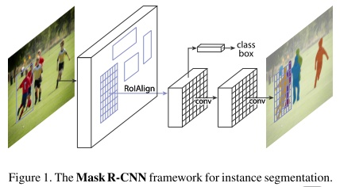
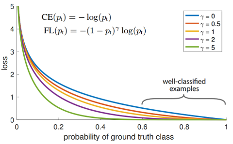
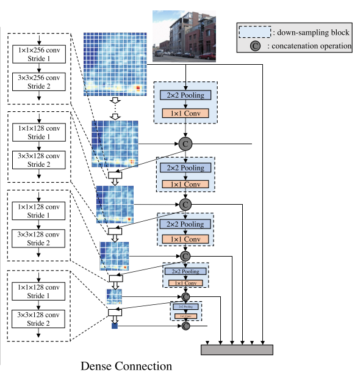
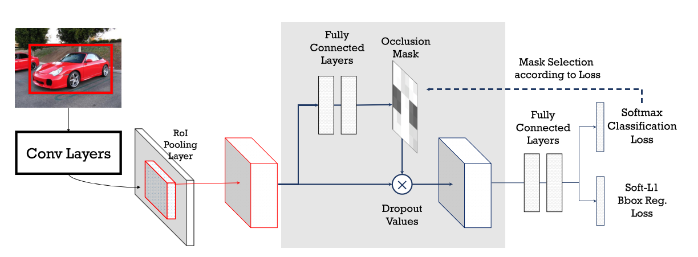
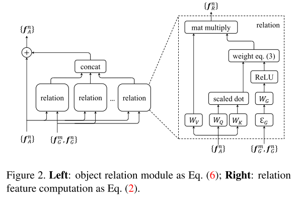
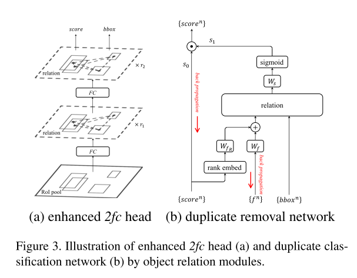

# （五）目标检测新趋势拾遗

## 文章结构

本篇为读者展现检测领域多样性的一个视角，跟其他任务联合，有YOLO9000、Mask R-CNN；改进损失函数，有Focal Loss；利用GAN提升检测模型的鲁棒性，有A-Fast-RCNN；建模目标关联，有Relation Moduel；还有mimicking思路、引入大batch训练的MegDet和从零训练的DSOD，再加上未收录的Cascade R-CNN、SNIP等，多样性的思路为检测任务的解决上注入着前所未有的活力，也推动着理解视觉这一终极目标的进步。

## 工作拾遗

### YOLO9000

[YOLO9000: Better, Faster, Stronger](https://arxiv.org/1612.08242)

这篇文章里，YOLO的作者不仅提出YOLOv2，大幅改进了原版YOLO，而且介绍了一种新的联合训练方式：同时训练分类任务和检测任务，使得检测模型能够泛化到检测训练集之外的目标类上。

YOLO9000使用了ImageNet和COCO数据集联合训练，在合并两者的标签时，根据WordNet的继承关系构建了了树状的类别预测图：

 _标签的合并_

类似条件概率的方式计算每个子标签的概率值，超出一定的阈值com时则选定该类作为输出，训练时也仅对其路径上的类别进行损失的计算和BP。

YOLO9000为我们提供了一种泛化检测模型的训练方式，文章的结果显示YOLO9000在没有COCO标注的类别上有约20的mAP表现，能够检测的物体类别超过9000种。当然，其泛化性能也受检测标注类别的制约，在有类别继承关系的类上表现不错，而在完全没有语义联系的类上表现很差。

### Mask R-CNN

Mask R-CNN通过将检测和实例分割联合训练的方式同时提高了分割和检测的精度。在原有Faster R-CNN的头部中分类和位置回归两个并行分支外再加入一个实例分割的并行分支，并将三者的损失联合训练。

 _Mask R-CNN的头部结构_

在分割方面，文章发现对每个类别单独生成二值掩膜（Binary Mask）相比之前工作中的多分类掩膜更有效，这样避免了类间竞争，仍是分类和标记的解耦。文章另外的一个贡献是RoIAlign的提出，笔者认为会是检测模型的标配操作。

FAIR团队在COCO Chanllege 2017上基于Mask R-CNN也取得了前列的成绩，但在实践领域，实例分割的标注相比检测标注要更加昂贵，而且按照最初我们对图像理解的三个层次划分，中层次的检测任务借用深层次的分割信息训练，事实上超出了任务的要求。

### Focal Loss（RetinaNet）

[Focal Loss for Dense Object Detection](https://arxiv.org/1708.02002)

由于缺少像两阶段模型的样本整理操作，单阶段模型的检测头部常常会面对比两阶段多出1-2个数量级的Region Proposal，文章作者认为，这些Proposal存在类别极度不均衡的现象，导致了简单样本的损失掩盖了难例的损失，这一easy example dominating的问题是单阶段模型精度不如两阶段的关键。

 _Focal Loss随概率变化曲线_

于是，文章提出的解决措施即是在不同样本间制造不平衡，让简单样本的损失在整体的贡献变小，使模型更新时更关注较难的样本。具体的做法是根据预测概率给交叉熵的相应项添加惩罚系数，使得预测概率越高（越有把握）的样本，计算损失时所占比例越小。

 _RetinaNet结构_

以ResNet的FPN为基础网络，添加了Focal Loss的RetinaNet取得了跟两阶段模型相当甚至超出的精度。另外，Focal Loss的应用也不只局限在单阶段检测器，其他要处理类别不均衡问题任务上的应用也值得探索。

### Mimicking

[Mimicking Very Efficient Network for Object Detection](http://openaccess.thecvf.com/content_cvpr_2017/papers/Li_Mimicking_Very_Efficient_CVPR_2017_paper.pdf)

本篇文章是Mimicking方法在检测任务上的尝试。mimicking作为一种模型压缩的方法，采用大网络指导小网络的方式将大网络习得的信息用小网络表征出来，在损失较小精度的基础上大幅提升速度。

Mimicking方法通常会学习概率输出的前一层，被称为"Deep-ID"，这一层的张量被认为是数据在经过深度网络后得到的一个高维空间嵌入，在这个空间中，不同类的样例可分性要远超原有表示，从而达到表示学习的效果。本文作者提出的mimicking框架则是选择检测模型中基础网络输出的feature map进行学习，构成下面的结构：

 _Mimicking网络结构_

图中，上面分支是进行学习的小网络，下面分支的大网络则由较好表现的模型初始化，输入图片后，分别得到不同的feature map，小网络同时输入RPN的分类和位置回归，根据这一RoI Proposal，在两个分支的feature map上提取区域feature，令大网络的feature作为监督信息跟小网络计算L2 Loss，并跟RPN的损失构成联合损失进行学习。而对RCNN子网络，可用分类任务的mimicking方法进行监督。

文章在Pascal VOC上的实验显示这种mimicking框架可以在相当的精度下实现2倍以上的加速效果。

### CGBN（Cross GPU Batch Normalization）

[MegDet: A Large Mini-Batch Object Detector](https://arxiv.org/abs/1711.07240)

这篇文章提出了多卡BN的实现思路，使得检测模型能够以较大的batch进行训练。

之前的工作中，两阶段模型常常仅在一块GPU上处理1-2张图片，生成数百个RoI Proposal供RCNN子网络训练。这样带来的问题是每次更新只学习了较少语义场景的信息，不利于优化的稳定收敛。要提高batch size，根据Linear Scaling Rule，需要同时增大学习率，但较大的学习率又使得网络不易收敛，文章尝试用更新BN参数的方式来稳定优化过程（基础网络的BN参数在检测任务上fine-tuning时通常固定）。加上检测中常常需要较大分辨率的图片，而GPU内存限制了单卡上的图片个数，提高batch size就意味着BN要在多卡（Cross-GPU）上进行。

BN操作需要对每个batch计算均值和方差来进行标准化，对于多卡，具体做法是，单卡独立计算均值，聚合（类似Map-Reduce中的Reduce）算均值，再将均值下发到每个卡，算差，再聚合起来，计算batch的方差，最后将方差下发到每个卡，结合之前下发的均值进行标准化。

 _CGBN实现流程_

更新BN参数的检测模型能够在较大的batch size下收敛，也大幅提高了检测模型的训练速度，加快了算法的迭代速度。

### DSOD（Deeply Supervised Object Detector）

[DSOD: Learning Deeply Supervised Object Detectors from Scratch](https://arxiv.org/abs/1708.01241)

R-CNN工作的一个深远影响是在大数据集（分类）上pre-train，在小数据集（检测）fine-tune的做法，本文指出这限制了检测任务上基础网络结构的调整（需要在ImageNet上等预训练的分类网络），也容易引入分类任务的bias，因而提出从零训练检测网络的方法。

作者认为，由于RoI的存在，两阶段检测模型从零训练难以收敛，从而选择Region-free的单阶段方法进行尝试。一个关键的发现是，从零训练的网络需要Deep Supervision，文中采用紧密连接的方式来达到隐式Deep Supervision的效果，因而DSOD的基础网络部分类似DenseNet，浅层的feature map也有机会得到更接近损失函数的监督。

文章的实验显示，DSOD从零开始训练也可以达到更SSD等相当的精度，并且模型的参数更少，但速度方面有所下降。

### A-Fast-RCNN

[A-Fast-RCNN: Hard Positive Generation via Adversary for Object Detection](https://arxiv.org/abs/1704.03414)

本文将GAN引入检测模型，用GAN生成较难的样本以提升检测网络应对遮挡(Occlusion)、形变(Deformation)的能力。

对于前者，作者设计了ASDN(Adversarial Spatial Dropout Network)，在feature map层面生成mask来产生对抗样本。对于feature map，在旁支上为每个位置生成一个概率图，根据一定的阈值将部分feature map上的值drop掉，再传入后面的头部网络。

类似的，ASTN(Adversarial Spatial Transformer Network)在旁支上生成旋转等形变并施加到feature map上。整体上，两个对抗样本生成的子网络串联起来，加入到RoI得到的feature和头部网络之间。

文中的实验显示，在VOC上，对抗训练对plant, bottle等类别的检测精度有提升，但对个别类别却有损害。这项工作是GAN在检测任务上的试水，在feature空间而不是原始数据空间生成对抗样本的思路值得借鉴。

### Relation Module

[Relation Networks for Object Detection](https://arxiv.org/abs/1711.11575)

Attention机制在自然语言处理领域取得了有效的进展，也被SENet等工作引入的计算机视觉领域。本文试图用Attention机制建模目标物体之间的相关性。

理解图像前背景的语义关系是检测任务的潜在目标，权威数据集COCO的收集过程也遵循着在日常情景中收集常见目标的原则，本文则从目标物体间的关系入手，用geometric feature(f_G)和appearance feature(f_A)来表述某一RoI，并联合其他RoI建立relation后，生成一个融合后的feature map。计算如下图：

作者将这样的模块插入两阶段检测器的头部网络，并用改装后的duplicate removal network替代传统的NMS后处理操作，形成真正端到端的检测网络。在Faster R-CNN, FPN, Deformable ConvNets上的实验显示，加入Relation Module均能带来精度提升。

## 结语

检测领域在近年来取得的进展只是这场深度模型潮流的一个缩影。

本系列文章梳理了检测任务上深度方法的经典工作和较新的趋势，并总结了常用的测评集和训练技巧，期望为读者建立对这一任务的基本认识。在介绍对象的选择和章节的划分上，都带有笔者自己的偏见，本文仅仅可作为一个导读，更多的细节应参考实现的代码，更多的讨论应参考文章作者的扩展实验。事实上，每项工作都反映着作者对这一问题的洞察，而诸多工作间的横向对比也有助于培养独立和成熟的视角来评定每项工作的贡献。另外，不同文献间的相互引述、所投会议期刊审稿人的意见等，都是比本文更有参考价值的信息来源。

在工业界还有更多的问题，比如如何做到单模型满足各种不同场景的需求，如何解决标注中的噪声和错误干扰，如何针对具体业务类型（如人脸）设计特定的网络，如何在廉价的硬件设备上做更高性能的检测，如何利用优化的软件库、模型压缩方法进行加速等等，就不在本文讨论之列。欢迎感兴趣的同学来格灵深瞳实习和交流。
