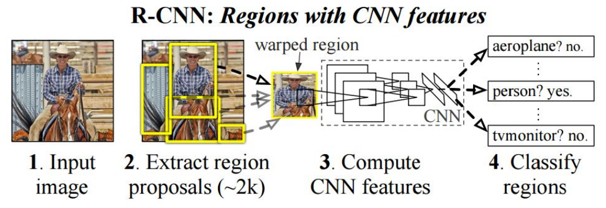
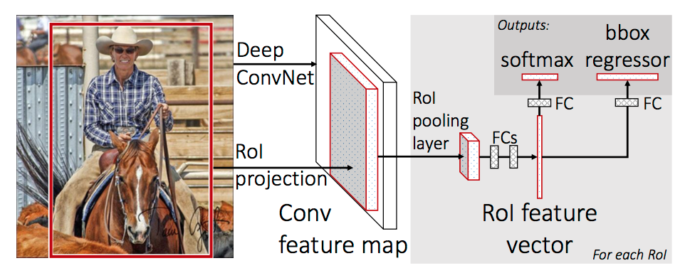
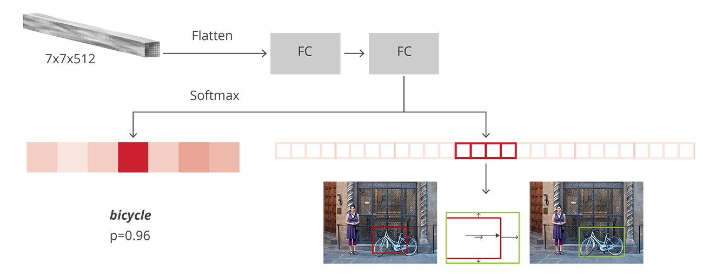

# （一）目标检测经典模型回顾

## 目标检测的任务表述

如何从图像中解析出可供计算机理解的信息，是机器视觉的中心问题。深度学习模型由于其强大的表示能力，加之数据量的积累和计算力的进步，成为机器视觉的热点研究方向。

那么，如何理解一张图片？根据后续任务的需要，有三个主要的层次。

 _图像理解的三个层次_

一是分类（Classification），即是将图像结构化为某一类别的信息，用事先确定好的类别(string)或实例ID来描述图片。这一任务是最简单、最基础的图像理解任务，也是深度学习模型最先取得突破和实现大规模应用的任务。其中，ImageNet是最权威的评测集，每年的ILSRVC催生了大量的优秀深度网络结构，为其他任务提供了基础。在应用领域，人脸、场景的识别都可以归为分类任务，其中，基于人脸识别的验证方案已经实现商用。

二是检测（Detection）。分类任务关心整体，给出的是整张图片的内容描述，而检测则关注特定的物体目标，要求同时获得这一目标的类别信息和位置信息。相比分类，检测给出的是对图片前景和背景的理解，我们需要从背景中分离出感兴趣的目标，并确定这一目标的描述（类别和位置），因而，检测模型的输出是一个列表，列表的每一项使用一个数据组给出检出目标的类别和位置（常用矩形检测框的坐标表示）。

三是分割（Segmentation）。分割包括语义分割（semantic segmentation）和实例分割（instance segmentation），前者是对前背景分离的拓展，要求分离开具有不同语义的图像部分，而后者是检测任务的拓展，要求描述出目标的轮廓（相比检测框更为精细）。分割是对图像的像素级描述，它赋予每个像素类别（实例）意义，适用于理解要求较高的场景，如无人驾驶中对道路和非道路的分割。

本系列文章关注的领域是目标检测，即图像理解的中层次。

## 两阶段（2-stage）检测模型

### R-CNN: R-CNN系列的开山之作

[Rich feature hierarchies for accurate object detection and semantic segmentation](https://arxiv.org/abs/1311.2524)

本文的两大贡献：1）CNN可用于基于区域的定位和分割物体；2）监督训练样本数紧缺时，在额外的数据上预训练的模型经过fine-tuning可以取得很好的效果。第一个贡献影响了之后几乎所有2-stage方法，而第二个贡献中用分类任务（Imagenet）中训练好的模型作为基网络，在检测问题上fine-tuning的做法也在之后的工作中一直沿用。

传统的计算机视觉方法常用精心设计的手工特征(如SIFT, HOG)描述图像，而深度学习的方法则倡导习得特征，从图像分类任务的经验来看，CNN网络自动习得的特征取得的效果已经超出了手工设计的特征。本篇在局部区域应用卷积网络，以发挥卷积网络学习高质量特征的能力。

 _R-CNN网络结构_

R-CNN将检测抽象为两个过程，一是基于图片提出若干可能包含物体的区域（即图片的局部裁剪），文中使用的是Selective Search算法；二是在提出的这些区域上运行当时表现最好的分类网络（AlexNet），得到每个区域内物体的类别。

文章中特别提到，IoU的选择（即正负样例的标签准备）对结果影响显著，这里要谈两个threshold，一个用来识别正样本（IOU跟ground truth较高），另一个用来标记负样本（即背景类），而介于两者之间的则为hard negatives，若标为正类，则包含了过多的背景信息，反之又包含了要检测物体的特征，因而这些proposal便被忽略掉。另一个重要的问题是bounding-box regression，这一过程是proposal向ground truth调整，实现时加入了log/exp变换来使loss保持在合理的量级上。这些做法被后来的大部分工作沿用。

#### 小结

R-CNN的想法直接明了，即是将CNN在分类上取得的成就运用在检测上，是深度学习方法在检测任务上的试水。模型本身存在的问题也很多，如需要训练三个不同的模型（proposal, classification, regression）、重复计算过多导致的性能问题等。尽管如此，这篇论文的很多做法仍然广泛地影响着检测任务上的深度模型革命，后续的很多工作也都是针对改进文章中的pipeline而展开，此篇可以称得上"the first paper"。

### Fast R-CNN: 共享卷积运算

[Fast R-CNN](https://arxiv.org/abs/1504.08083)

Fast R-CNN 是对R-CNN的改进，作者栏只有RBG一人。文章先指出了R-CNN存在的问题，再介绍了自己的改进思路。文章结构堪称典范，从现存问题，到解决方案、实验细节，再到结果分析、拓展讨论，条分缕析，值得借鉴。而且，RBG开源的代码也影响了后来大部分这一领域的工作。

文章认为耗时的原因是CNN是在每一个Proposal上单独进行的，没有共享计算，便提出将基础网络在图片整体上运行完毕后，再传入R-CNN子网络，共享了大部分计算，故有fast之名。

 _Fast R-CNN网络结构_

上图是Fast R-CNN的架构。图片经过feature extractor产生feature map, 原图上运行Selective Search算法将RoI（Region of Interset，实为坐标组）映射到到feature map上，再对每个RoI进行RoI Pooling操作便得到等长的feature vector，最后通过FC后并行地进行Classifaction和BBox Regression。

 _RoI Pooling图示（[来源](https://blog.deepsense.ai/region-of-interest-pooling-explained/)）_

RoI Pooling 是对输入R-CNN子网络的数据进行准备的关键操作。我们得到的区域常常有不同的大小，在映射到feature map上之后，会得到不同大小的特征表述。RoI Pooling先将RoI等分成目标个数的网格，再在每个网格上进行max pooling，就得到等长的RoI feature vector。将这些得到的feature vector进行正负样本的整理（保持一定的正负样本比例），分batch传入并行的R-CNN子网络，同时进行分类和回归，并将两者的损失统一起来。

文章最后的讨论也有一定的借鉴意义：

- multi-loss traing相比单独训练Classification确有提升
- Scale invariance方面，multi-scale相比single-scale精度略有提升，但带来的时间开销更大。一定程度上说明CNN结构可以内在地学习scale invariance
- 在更多的数据(VOC)上训练后，mAP是有进一步提升的
- Softmax分类器比"one vs rest"型的SVM表现略好，引入了类间的竞争
- 更多的Proposal并不一定带来性能的提升

#### 小结

Fast R-CNN的这一结构正是检测任务主流2-stage方法所采用的元结构的雏形。文章将Proposal, Feature Extractor, Object Recognition&Localization统一在一个整体的结构中，并推进共享卷积计算以提高效率的想法演进，是最有贡献的地方。

### Faster R-CNN: 两阶段模型的深度化

[Faster R-CNN: Towards Real Time Object Detection with Region Proposal Networks](https://arxiv.org/abs/1506.01497)

Faster R-CNN是2-stage方法的主流方法，提出的RPN网络取代Selective Search算法使得检测任务可以由神经网络端到端地完成。粗略的讲，Faster R-CNN = RPN + Fast R-CNN，跟RCNN共享卷积计算的特性使得RPN引入的计算量很小，使得Faster R-CNN可以在单个GPU上以5fps的速度运行，而在精度方面达到SOTA。

本文的主要贡献是提出Regional Proposal Networks，替代之前的SS算法。RPN网络将Proposal这一任务建模为二分类（是否为物体）的问题。

 _Faster R-CNN网络结构_

第一步是在一个滑动窗口上生成不同大小和长宽比例的anchor box（如上图右边部分），取定IoU的阈值，按Ground Truth标定这些anchor box的正负。于是，传入RPN网络的样本即是anchor box和每个anchor box是否有物体。RPN网络将每个样本映射为一个概率值和四个坐标值，概率值反应这个anchor box有物体的概率，四个坐标值用于回归定义物体的位置。最后将二分类和坐标回归的Loss统一起来，作为RPN网络的目标训练。之后，这些样本被传入R-CNN子网络，进行多分类和坐标回归，同样用多任务loss将二者的损失联合。

#### 小结

Faster R-CNN的成功之处在于用RPN网络完成了检测任务的"深度化"。使用滑动窗口生成anchor box的思想也在后来的工作中越来越多地被采用（YOLO v2等）。RPN网络也成为检测2-stage方法的标准部件。

## 单阶段（1-stage）检测模型

### YOLO

[You Only Look Once: Unified, Real-Time Object Detection](https://arxiv.org/abs/1506.02640)

YOLO是单阶段方法的开山之作。它将检测任务表述成一个统一的、端到端的回归问题，并且以只处理一次图片同时得到位置和分类而得名。

YOLO的主要优点：

- 快。
- 全局处理使得背景错误相对少，相比基于局部（区域）的方法， 如Fast RCNN。
- 泛化性能好，在艺术作品上做检测时，YOLO表现好。

 _YOLO网络结构_

YOLO的大致工作流程如下：

1.准备数据：将图片缩放，划分为等分的网格，每个网格按跟ground truth的IOU分配到所要预测的样本。

2.卷积网络：由GoogLeNet更改而来，每个网格对每个类别预测一个条件概率值，并在网格基础上生成B个box，每个box预测五个回归值，四个表征位置，第五个表征这个box含有物体（注意不是某一类物体）的概率和位置的准确程度（由IOU表示）。测试时，分数如下计算： 等式左边第一项由网格预测，后两项由每个box预测，综合起来变得到每个box含有不同类别物体的分数。 因而，卷积网络共输出的预测值个数为S×S×(B×5+C)，S为网格数，B为每个网格生成box个数，C为类别数。

3.后处理：使用NMS过滤得到的box

#### 损失函数的设计

 _YOLO的损失函数分解，（[来源](https://zhuanlan.zhihu.com/p/24916786)）_

损失函数被分为三部分：坐标误差、物体误差、类别误差。为了平衡类别不均衡和大小物体等带来的影响，损失函数中添加了权重并将长宽取根号。

#### 小结

YOLO提出了单阶段的新思路，相比两阶段方法，其速度优势明显，实时的特性令人印象深刻。但YOLO本身也存在一些问题，如划分网格较为粗糙，每个网格生成的box个数等限制了对小尺度物体和相近物体的检测。

### SSD: Single Shot Multibox Detector

[SSD: Single Shot Multibox Detector](https://arxiv.org/abs/1512.02325)

 _SSD网络结构_

SSD相比YOLO有以下突出的特点：

- 多尺度的feature map：基于VGG的不同卷积段，输出feature map到回归器中。这一点试图提升小物体的检测精度。
- 更多的anchor box，每个网格点生成不同大小和长宽比例的box，并将类别预测概率基于box预测（YOLO是在网格上），得到的输出值个数为(C+4)×k×m×n，其中C为类别数，k为box个数，m×n为feature map的大小。

#### 小结

SSD是单阶段模型的集大成者，达到跟两阶段模型相当精度的同时，拥有比两阶段模型快一个数量级的速度。后续的单阶段模型工作大多基于SSD改进展开。

## 检测模型基本特点

最后，我们对检测模型的基本特征做一个简单的归纳。Faster R-CNN和SSD奠定了两阶段和单阶段检测模型的基本形态，深刻地影响着检测领域后续的大部分工作。

 _两阶段检测模型Pipeline_

检测模型整体上由基础网络（Backbone Network）和检测头部（Detection Head）构成。前者作为特征提取器，给出图像不同大小、不同抽象层次的表示；后者则依据这些表示和监督信息学习类别和位置关联。检测头部负责的类别预测和位置回归两个任务常常是并行进行的，构成多任务的损失进行联合训练。

 _检测模型头部并行的分支_

相比单阶段，两阶段检测模型通常含有一个串行的头部结构，即完成前背景分类和回归后，把中间结果作为RCNN头部的输入再进行一次多分类和位置回归。这种设计带来了一些优点：

- 对检测任务的解构，先进行前背景的分类，再进行物体的分类
- RPN网络为RCNN网络提供良好的先验，并有机会整理样本的比例，减轻RCNN网络的学习负担

这种设计的缺点也很明显：中间结果常常带来空间开销，而串行的方式也使得推断速度无法跟单阶段相比；级联的位置回归则会导致RCNN部分的重复计算（如两个RoI有重叠）。

另一方面，单阶段模型只有一次类别预测和位置回归，卷积运算的共享程度更高，拥有更快的速度和更小的内存占用。

在下一篇中，我们将介绍检测模型的评测指标与评测数据集，并总结常用的训练和建模技巧。
