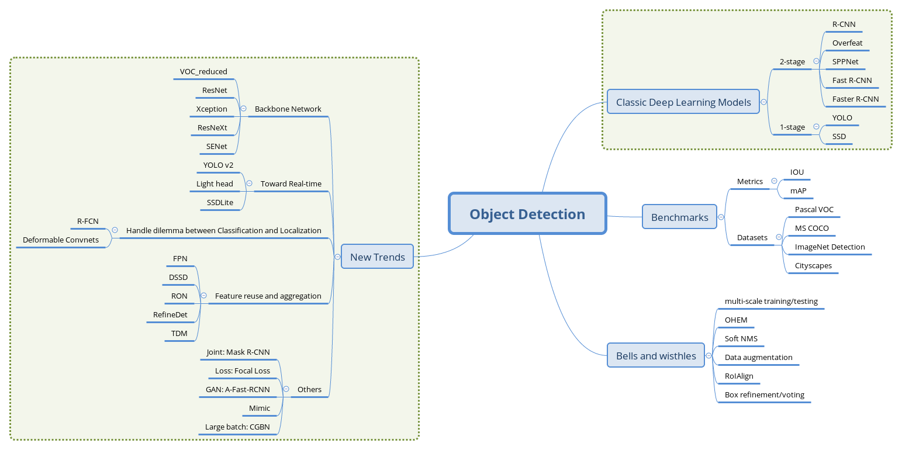
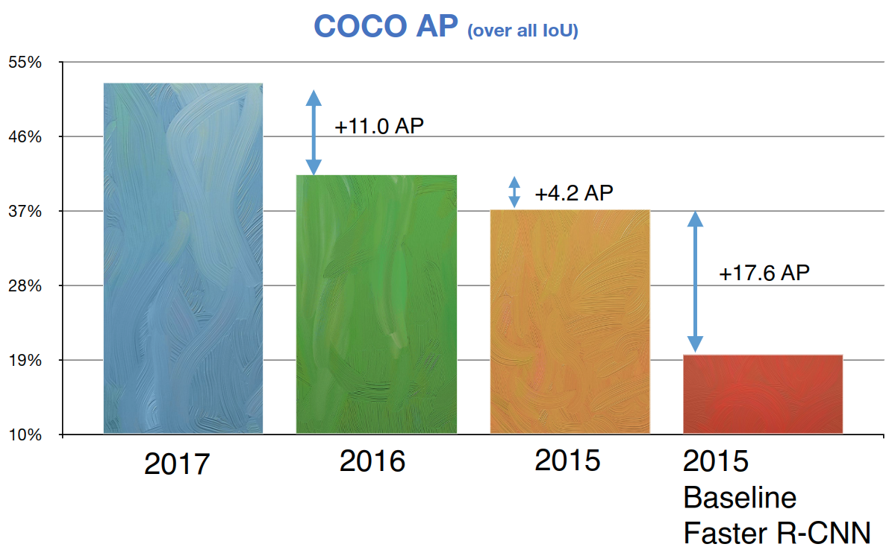
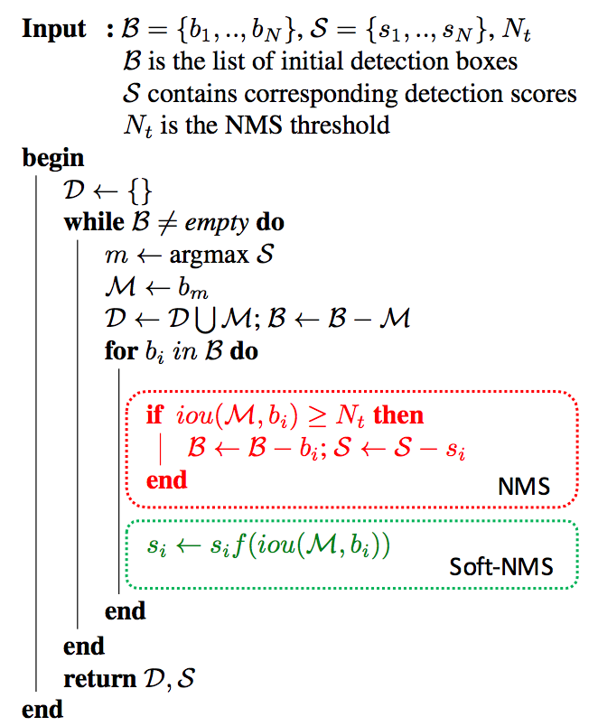
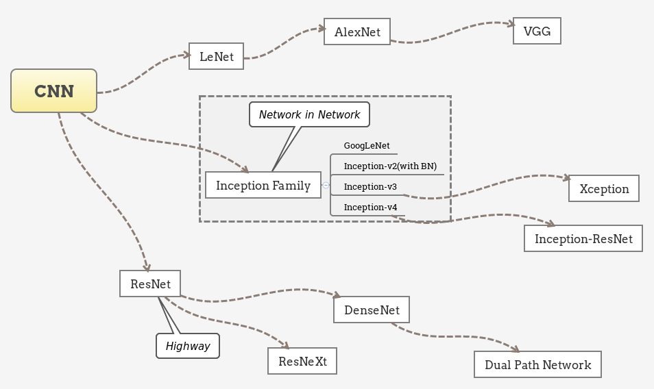
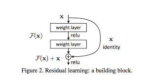
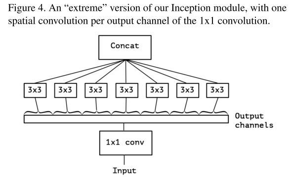
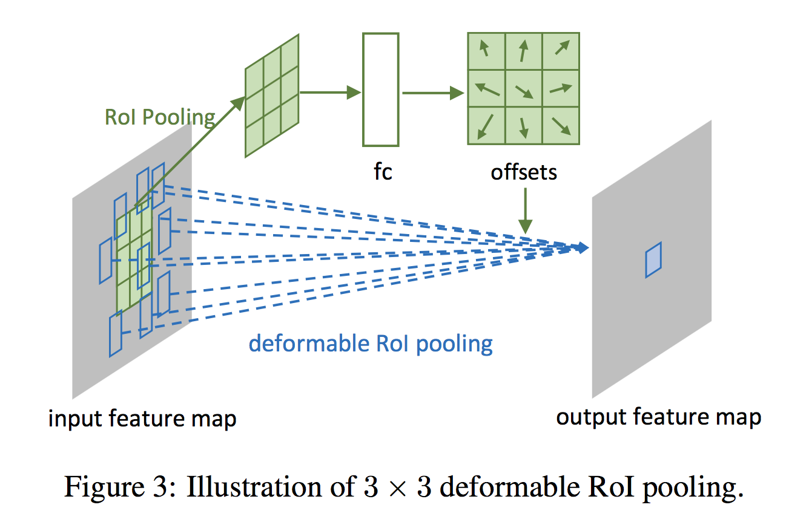

## 目标检测小综述

近年来，深度学习模型逐渐取代传统CV方法而成为目标检测领域的主流算法，本系列文章将回顾目标检测领域的经典模型，并介绍新的趋势。

大纲

（一）目标检测经典模型回顾

（二）目标检测模型的评测与训练技巧

（三）目标检测领域的新趋势之基础网络结构演进、分类定位的权衡

（四）目标检测领域的新趋势之特征复用、实时性

（五）目标检测的新趋势拾遗

### （一）目标检测经典模型回顾

#### 目标检测的任务表述

如何从图像中解析出可供计算机理解的信息，是机器视觉的中心问题。深度学习模型由于其强大的表示能力，加之数据量的积累和计算力的进步，成为机器视觉的热点研究方向。

那么，如何理解一张图片？根据后续任务的需要，有三个主要的层次。

一是分类（Classification），即是将图像结构化为某一类别的信息，用事先确定好的类别(string)或实例ID来描述图片。这一任务是最简单、最基础的图像理解任务，也是深度学习模型最先取得突破和实现大规模应用的任务。其中，ImageNet是最权威的评测集，每年的ILSRVC催生了大量的优秀深度网络结构，为其他任务提供了基础。在应用领域，人脸、场景的识别都可以归为分类任务，其中，基于人脸识别的验证方案已经实现商用。

二是检测（Detection）。分类任务关心整体，给出的是整张图片的内容描述，而检测则关注特定的物体目标，要求同时获得这一目标的类别信息和位置信息。相比分类，检测给出的是对图片前景和背景的理解，我们需要从背景中分离出感兴趣的目标，并确定这一目标的描述（类别和位置），因而，检测模型的输出是一个列表，列表的每一项使用一个数据组给出检出目标的类别和位置（常用矩形检测框的坐标表示）。

三是分割（Segmentation）。分割包括语义分割（semantic segmentation）和实例分割（instance segmentation），前者是对前背景分离的拓展，要求分离开具有不同语义的图像部分，而后者是检测任务的拓展，要求描述出目标的轮廓（相比检测框更为精细）。分割是对图像的像素级描述，它赋予每个像素类别（实例）意义，适用于理解要求较高的场景，如无人驾驶中对道路和非道路的分割。

本系列文章关注的领域是目标检测，即图像理解的中层次。

#### 两阶段（2-stage）检测模型

##### R-CNN: R-CNN系列的开山之作

[Rich feature hierarchies for accurate object detection and semantic segmentation](https://arxiv.org/abs/1311.2524)

本文的两大贡献：1）CNN可用于基于区域的定位和分割物体；2）监督训练样本数紧缺时，在额外的数据上预训练的模型经过fine-tuning可以取得很好的效果。第一个贡献影响了之后几乎所有2-stage方法，而第二个贡献中用分类任务（Imagenet）中训练好的模型作为基网络，在检测问题上fine-tuning的做法也在之后的工作中一直沿用。

传统的计算机视觉方法常用精心设计的手工特征(如SIFT, HOG)描述图像，而深度学习的方法则倡导习得特征，从图像分类任务的经验来看，CNN网络自动习得的特征取得的效果已经超出了手工设计的特征。本篇在局部区域应用卷积网络，以发挥卷积网络学习高质量特征的能力。

R-CNN将检测抽象为两个过程，一是基于图片提出若干可能包含物体的区域（即图片的局部裁剪），文中使用的是Selective Search算法；二是在提出的这些区域上运行当时表现最好的分类网络（AlexNet），得到每个区域内物体的类别。

文章中特别提到，IoU的选择（即正负样例的标签准备）对结果影响显著，这里要谈两个threshold，一个用来识别正样本（IOU跟ground truth较高），另一个用来标记负样本（即背景类），而介于两者之间的则为hard negatives，若标为正类，则包含了过多的背景信息，反之又包含了要检测物体的特征，因而这些proposal便被忽略掉。另一个重要的问题是bounding-box regression，这一过程是proposal向ground truth调整，实现时加入了log/exp变换来使loss保持在合理的量级上。这些做法被后来的大部分工作沿用。

###### 小结

R-CNN的想法直接明了，即是将CNN在分类上取得的成就运用在检测上，是深度学习方法在检测任务上的试水。模型本身存在的问题也很多，如需要训练三个不同的模型（proposal, classification, regression）、重复计算过多导致的性能问题等。尽管如此，这篇论文的很多做法仍然广泛地影响着检测任务上的深度模型革命，后续的很多工作也都是针对改进文章中的pipeline而展开，此篇可以称得上"the first paper"。

##### Fast R-CNN: 共享卷积运算

[Fast R-CNN](https://arxiv.org/abs/1504.08083)

Fast R-CNN 是对R-CNN的改进，作者栏只有RBG一人。文章先指出了R-CNN存在的问题，再介绍了自己的改进思路。文章结构堪称典范，从现存问题，到解决方案、实验细节，再到结果分析、拓展讨论，条分缕析，值得借鉴。而且，RBG开源的代码也影响了后来大部分这一领域的工作。

文章认为耗时的原因是CNN是在每一个Proposal上单独进行的，没有共享计算，便提出将基础网络在图片整体上运行完毕后，再传入R-CNN子网络，共享了大部分计算，故有fast之名。

上图是Fast R-CNN的架构。图片经过feature extractor产生feature map, 原图上运行Selective Search算法将RoI（Region of Interset，实为坐标组）映射到到feature map上，再对每个RoI进行RoI Pooling操作便得到等长的feature vector，最后通过FC后并行地进行Classifaction和BBox Regression。

RoI Pooling 是对输入R-CNN子网络的数据进行准备的关键操作。我们得到的区域常常有不同的大小，在映射到feature map上之后，会得到不同大小的特征表述。RoI Pooling先将RoI等分成目标个数的网格，再在每个网格上进行max pooling，就得到等长的RoI feature vector。将这些得到的feature vector进行正负样本的整理（保持一定的正负样本比例），分batch传入并行的R-CNN子网络，同时进行分类和回归，并将两者的损失统一起来。

文章最后的讨论也有一定的借鉴意义：

- multi-loss traing相比单独训练Classification确有提升
- Scale invariance方面，multi-scale相比single-scale精度略有提升，但带来的时间开销更大。一定程度上说明CNN结构可以内在地学习scale invariance
- 在更多的数据(VOC)上训练后，mAP是有进一步提升的
- Softmax分类器比"one vs rest"型的SVM表现略好，引入了类间的竞争
- 更多的Proposal并不一定带来性能的提升

###### 小结
Fast R-CNN的这一结构正是检测任务主流2-stage方法所采用的元结构的雏形。文章将Proposal, Feature Extractor, Object Recognition&Localization统一在一个整体的结构中，并推进共享卷积计算以提高效率的想法演进，是最有贡献的地方。

##### Faster R-CNN: 两阶段模型的深度化

[Faster R-CNN: Towards Real Time Object Detection with Region Proposal Networks](https://arxiv.org/abs/1506.01497)

Faster R-CNN是2-stage方法的主流方法，提出的RPN网络取代Selective Search算法使得检测任务可以由神经网络端到端地完成。粗略的讲，Faster R-CNN = RPN + Fast R-CNN，跟RCNN共享卷积计算的特性使得RPN引入的计算量很小，使得Faster R-CNN可以在单个GPU上以5fps的速度运行，而在精度方面达到SOTA。

本文的主要贡献是提出Regional Proposal Networks，替代之前的SS算法。RPN网络将Proposal这一任务建模为二分类（是否为物体）的问题。

第一步是在一个滑动窗口上生成不同大小和长宽比例的anchor box（如上图右边部分），取定IoU的阈值，按Ground Truth标定这些anchor box的正负。于是，传入RPN网络的样本即是anchor box和每个anchor box是否有物体。RPN网络将每个样本映射为一个概率值和四个坐标值，概率值反应这个anchor box有物体的概率，四个坐标值用于回归定义物体的位置。最后将二分类和坐标回归的Loss统一起来，作为RPN网络的目标训练。之后，这些样本被传入R-CNN子网络，进行多分类和坐标回归，同样用多任务loss将二者的损失联合。

###### 小结
Faster R-CNN的成功之处在于用RPN网络完成了检测任务的“深度化”。使用滑动窗口生成anchor box的思想也在后来的工作中越来越多地被采用（YOLO v2等）。RPN网络也成为检测2-stage方法的标准部件。

#### 单阶段（1-stage）检测模型

##### YOLO

[You Only Look Once: Unified, Real-Time Object Detection](https://arxiv.org/abs/1506.02640)

YOLO是单阶段方法的开山之作。它将检测任务表述成一个统一的、端到端的回归问题，并且以只处理一次图片同时得到位置和分类而得名。

YOLO的主要优点：

- 快。
- 全局处理使得背景错误相对少，相比基于局部（区域）的方法， 如Fast RCNN。
- 泛化性能好，在艺术作品上做检测时，YOLO表现好。

YOLO的大致工作流程如下：

1.准备数据：将图片缩放，划分为等分的网格，每个网格按跟ground truth的IOU分配到所要预测的样本。

2.卷积网络：由GoogLeNet更改而来，每个网格对每个类别预测一个条件概率值，并在网格基础上生成B个box，每个box预测五个回归值，四个表征位置，第五个表征这个box含有物体（注意不是某一类物体）的概率和位置的准确程度（由IOU表示）。测试时，分数如下计算：
等式左边第一项由网格预测，后两项由每个box预测，综合起来变得到每个box含有不同类别物体的分数。
因而，卷积网络共输出的预测值个数为S×S×(B×5+C)，S为网格数，B为每个网格生成box个数，C为类别数。

3.后处理：使用NMS过滤得到的box

###### loss的设计

损失函数被分为三部分：坐标误差、物体误差、类别误差。为了平衡类别不均衡和大小物体等带来的影响，loss中添加了权重并将长宽取根号。

###### 小结

YOLO提出了单阶段的新思路，相比两阶段方法，其速度优势明显，实时的特性令人印象深刻。但YOLO本身也存在一些问题，如划分网格较为粗糙，每个网格生成的box个数等限制了对小尺度物体和相近物体的检测。

##### SSD: Single Shot Multibox Detector

[SSD: Single Shot Multibox Detector](https://arxiv.org/abs/1512.02325)

SSD相比YOLO有以下突出的特点：

- 多尺度的feature map：基于VGG的不同卷积段，输出feature map到回归器中。这一点试图提升小物体的检测精度。
- 更多的anchor box，每个网格点生成不同大小和长宽比例的box，并将类别预测概率基于box预测（YOLO是在网格上），得到的输出值个数为(C+4)×k×m×n，其中C为类别数，k为box个数，m×n为feature map的大小。

###### 小结

SSD是单阶段模型的集大成者，达到跟两阶段模型相当精度的同时，拥有比两阶段模型快一个数量级的速度。后续的单阶段模型工作大多基于SSD改进展开。

#### 检测模型基本特征

最后，我们对检测模型的基本特征做一个简单的归纳。

### （二）目标检测经典模型回顾

#### 检测模型的评测指标

目标检测模型本源上可以用统计推断的框架描述，我们关注其犯第一类错误和第二类错误的概率，通常用准确率和召回率来描述。准确率描述了模型有多准，即在预测为正例的结果中，有多少是真正例；召回率则描述了模型有多全，即在为真的样本中，有多少本我们的模型预测为正例。不同的任务，对两类错误有不同的偏好，常常在某一类错误不多于一定阈值的情况下，努力减少另一类错误。在检测中，mAP作为一个统一的指标将这两种错误兼顾计算。

具体地，对于每张图片，检测模型输出多个预测框（常常远超真实框的个数），我们使用IoU（Intersection Over Union，交并比）来标记预测框是否为预测正确。IoU计算了两个区域之交的面积跟它们之并的比，描述了两个区域的重合程度。标记完成后，随着预测框的增多，召回率总会提升，在不同的召回率水平下（通常为0.1, 0.2, ..., 0.9）对准确率做平均，即得到AP（Average Precision），最后再对所有类别按其所占比例做平均，即得到mAP。

在较早的Pascal VOC数据集上，常采用固定的一个IoU阈值（如0.5, 0.7）来计算mAP，现阶段较为权威的MS COCO数据集上，对不同的IoU阈值（0.5:0.05:0.95）分别计算AP，再综合平均，并且给出了不同大小物体分别的AP表现，对定位准确的模型给予奖励并全面地展现不同大小物体上检测算法的性能，更为科学合理。

在实践中，我们不仅关注检测模型的精度，还关注其运行的速度，常常用FPS（Frame Per Second，每秒帧率）来表示检测模型能够在指定硬件上每秒处理图片的张数。通常来讲，在GPU上，两阶段方法的FPS一般在个位数，而单阶段方法可以达到数十。但现在检测模型运行的平台并不统一，实践中也不能部署较为昂贵的GPU进行推断。事实上，很多论文也并没有严谨讨论其提出模型的速度表现，因而速度方面的指标并没有统一的参考标准，需要谨慎看待。

#### 标准评测数据集

##### Pascal VOC（Pascal Visual Object Classes, http://host.robots.ox.ac.uk/pascal/VOC/）

自2005年起每年举办一次比赛，最开始只有4类，到2007年扩充为20个类，共9963张图片，2012年的版本包括了08-11年的图片，共11530张，这两年是最为常用的两个版本，是早期检测模型的权威测评集，现阶段模型的入门测评集（类似人脸识别领域的lfw）。目前的mAP表现大多在80以上，leaderboard可以在http://host.robots.ox.ac.uk:8080/leaderboard/displaylb.php?challengeid=11&compid=4。

##### MS COCO（Common Objects in Context， http://cocodataset.org）

COCO是目前检测领域最权威的benchmark，自2014年起每年举办一次比赛，检测任务共有80个类。2014年发布的版本train/val/test分别为82,783/40,504/40,775张，学界常取14年版本的train set和部分（35k）val set作为训练集（trainval35k），剩下的5k val set数据作为评测（minival）。除去每年比赛用的保留数据外，官方会发布test-dev数据集作为研究之用，2017年的版本训练集为115k（train2014+val2014-val2017），评测集为5k（val2014的一部分），最后用于比赛的数据有41k。目前最好的结果已经提升到50，leaderboard在http://cocodataset.org/#detections-leaderboard。

TODO:
- [ ] Cityscapes
- [ ] Kitti

笔者也维护了一个检测模型进展追踪项目：[obj_det_progress_tracker](https://github.com/ddlee96/Obj_Det_progress_tracker)，可供参考

#### 检测模型中的Bells and wisthles

本小节介绍常见的提升检测模型性能的技巧，它们常作为trick在比赛中应用，部分技巧因其较小的开销也被应用在实践中。

##### Data augmentation 数据增强

数据增强是增加深度模型鲁棒性和泛化性能的常用手段，在检测中，常常对图片进行随机水平翻转和随机裁剪等操作来监督模型学习更一般的特征。

##### multi-scale training/testing 多尺度训练、测试

输入图片的尺寸对检测模型的性能影响相当明显。在基础网络部分常常会生成比原图小数十倍的特征图，导致小物体的特征描述不容易被检测网络捕捉。通过输入更大、更多尺寸的图片进行训练，能够在一定程度上提高检测模型对物体大小的鲁棒性，仅在测试阶段引入多尺度，也可享受大尺寸和多尺寸带来的增益。近期的工作如FPN等已经尝试在不同尺度的特征图上进行检测，但多尺度训练（测试）仍作为一种提升性能的技巧被应用在MS COCO等比赛中。

##### OHEM 在线难例挖掘

OHEM(Online Hard negative Example Mining，在线难例挖掘)见于2015年等人的工作。两阶段检测模型中，提出的RoI Proposal在输入R-CNN子网络前，我们有机会对正负样本（背景类和前景类）的比例进行调整。通常，背景类的RoI Proposal个数要远远多于前景类，Fast R-CNN的处理方式是随机对两种样本进行上采样和下采样，以使每一batch的正负样本比例保持在1:3，这一做法缓解了类别比例不均衡的问题，是两阶段方法相比单阶段方法具有优势的地方，也被后来的大多数工作沿用。

但在OHEM的工作中，作者提出用R-CNN子网络对RoI Proposal预测的分数来决定每个batch选用的样本，这样，输入R-CNN子网络的RoI Proposal总为其表现不好的样本，提高了监督学习的效率。实际操作中，维护两个完全相同的R-CNN子网络，其中一个只进行前向传播来为RoI Proposal的选择提供指导，另一个则为正常的R-CNN，参与损失的计算并更新权重，并且将权重复制到前者以使两个分支权重同步。

OHEM以额外的R-CNN子网络的开销来改善RoI Proposal的质量，更有效地利用数据的监督信息，成为两阶段模型提升性能的常用部件之一。

##### Soft NMS 软化非极大抑制

NMS(Non-Maximum Suppression，非极大抑制）是检测模型的标准后处理操作，用于去除重合度（IoU）较高的预测框，只保留预测分数最高的预测框作为检测输出。Soft NMS是等人2017的工作中提出来的。在传统的NMS中，跟最高预测分数预测框重合度超出一定阈值的预测框会被直接舍弃，作者认为这样不利于相邻物体的检测。提出的改进方法是根据IoU将预测框的预测分数进行惩罚，最后再按分数过滤。配合Deformable Convnets，Soft NMS在MS COCO上取得了当时最佳的表现。算法改进如下：

上图中的f即为软化函数，通常取线性或高斯函数，后者效果稍好一些。当然，在享受这一增益的同时，Soft-NMS也引入了一些超参，对不同的数据集需要试探以确定最佳配置。

##### RoIAlign RoI对齐

RoIAlign是Kaiming等在Mask R-CNN中提出的，针对的问题是RoI在进行Pooling时有不同程度的近似，这影响了实例分割中mask损失的计算。文章采用双线性插值的方法将RoI的表示精细化，并带来了较为明显的性能提升。这一技巧也被后来的一些工作（如light-head R-CNN）沿用。

TODO:
- [ ] Box Refinement/voting 预测框微调/投票法

### （三）目标检测新趋势之基础网络结构演进、分类与定位的权衡

从此篇开始，我们对近几年检测领域的工作做一些介绍，并试图从中归纳出一些趋势。本篇关注基础网络架构的演进和处理分类、定位这一矛盾问题上的进展。

#### 基础网络结构的演进

基础网络（Backbone network）作为特征提取器，对检测模型的性能有着至关重要的影响。每年的ILSRVC都会推动大批优秀网络结构的出现，在分类任务上表现出色的结构被引入到检测领域，常常也能取得正向的表现。

##### 卷积网络结构演进的趋势

笔者认为，卷积网络已经有如下几个经典的设计范式：

- Repeat. 由AlexNet和VGG等开拓，几乎被之后所有的网络采用。即堆叠相同的拓扑结构，整个网络成为模块化的结构。
- Multi-path. 由Inception系列发扬，将前一层的输入分割到不同的路径上进行变换，最后拼接结果。
- Skip-connection. 最初出现于Highway Network，由ResNet发扬并成为标配。即建立浅层信息与深层信息的传递通道，改变原有的单一线性结构。

以这些范式为脉络整理卷积网络的演进历程，可以归纳出下面的图景：

需要说明的是，上图并不能概括完全近年来卷积网络的进步，各分支之间也有很多相互借鉴和共通的特征，而致力于精简网络结构的工作如SqueezeNet等则没有出现。

另外一个重要的潮流是深度可分离卷积（Depth-wise seperable convolution）的应用。在下面几个小节，我们对几个经典的结构做一些介绍。

##### ResNet

[Deep Residual Learning for Image Recognition](http://arxiv.org/abs/1512.03385)

作者将网络的训练解释为对某一复杂函数的拟合，通过添加跳跃连接，变对这一函数的拟合为对残差的拟合，引入的恒等项也让BP得到的梯度更为稳定。

残差网络以skip-connection的设计较为成功地缓解了深层网络难以收敛的问题，将网络的深度提高了一个数量级，也带动了一系列对残差网络的解释研究和衍生网络的提出。

在检测领域，原来的VGG也逐渐被ResNet系列网络替代，文章中以ResNet作为基础网络的Faster R-CNN也常作为后续工作的基线进行比较。

##### Xception

[Xception: Deep Learning with Depthwise Separable Convolutions](https://arxiv.org/abs/1610.02357)

Xception网络可以看做对Inception系列网络的推进，也是深度可分离卷积的成功应用。

文章指出，Inception单元背后的假设是跨Channel和跨空间的相关性可以充分解耦，类似的还有长度和高度方向上的卷积结构（在Inception-v3里的3×3卷积被1×3和3×1卷积替代）。

进一步的，Xception基于更强的假设：跨channel和跨空间的相关性完全解耦。这也是深度可分离卷积所建模的理念。

一个简化的Inception单元：

等价于：

将channel的group推向极端，即每个channel都由独立的3×3卷积处理：

这样就得到了深度可分离卷积。

Xception最终的网络结构如下，简单讲是线性堆叠的Depthwise Separable卷积，并附加了Skip-connection。

在MS COCO Chanllege 2017中，MSRA团队以对齐版本的Xception为基础网络取得前列的成绩，一定程度上说明了这一网络提取特征的能力。

##### ResNeXt

[Aggregated Residual Transformations for Deep Neural Networks](https://arxiv.org/abs/1611.05431)

本文提出了深度网络的新维度，除了深度、宽度（Channel数）外，作者将在某一层并行transform的路径数提取为第三维度，称为"cardinality"。跟Inception单元不同的是，这些并行路径均共享同一拓扑结构，而非精心设计的卷积核并联。除了并行相同的路径外，也添加了层与层间的shortcut connection。

相比Inception-ResNet，ResNeXt相当于将其Inception Module的每条路径规范化了，并将规范后的路径数目作为新的超参数。

上图中，路径被扩展为多条，而每条路径的宽度（channel数）也变窄了（64->4）。

在近期Facebook开源的Detectron框架中，ResNeXt作为Mask R-CNN的基础网络也取得了非常高的精度。

##### SENet

[Squeeze and Excitation Network](https://arxiv.org/abs/1709.01507)

SENet是最后一届ImageNet Challenge的夺冠架构，中心思想是添加旁路为channel之间的相关性进行建模，可以认为是channel维度的attention。

SENet通过‘特征重标定’（Feature Recalibration）来完成channel层面的注意力机制。具体地，先通过Squeeze操作将特征的空间性压缩掉，仅保留channel维度，再通过Excitation操作为每个特征通道生成一个权重，用于显式地建模channel之间的相关性，最后通过Reweight操作将权重加权到原来的channel上，即构成不同channel间重标定。

SENet可以作为网络中模块间的额外连接附属到原有的经典结构上，其Squeeze操作在压缩信息的同时也降低了这一附属连接的开销。

#### 分类与定位问题的权衡

从R-CNN开始，检测模型常采用分类任务上表现最好的卷积网络作为基础网络提取特征，在其基础上添加额外的头部结构来实现检测功能。然而，分类和检测所面向的场景不尽相同：分类常常关注具有整体语义的图像，而检测则需要区分前景和背景。

分类网络中的Pooling层操作常常会引入平移不变性等使得整体语义的理解更加鲁棒，而在检测任务中我们则需要位置敏感的模型来保证预测位置的精确性，这就产生了分类和定位两个任务间的矛盾。

##### R-FCN

[R-FCN: Object Detection via Region-based Fully Convolutinal Networks](https://arxiv.org/abs/1605.06409)

文章指出了检测任务之前的框架存在不自然的设计，即全卷积的特征提取部分+全连接的分类器，而表现最好的图像分类器都是全卷积的结构（ResNet等）。这篇文章提出采用“位置敏感分数图”的方法来使检测网络保持全卷积结构的同时又拥有位置感知能力。

位置敏感分数图的生成有两个重要操作，一是生成更“厚”的feature map，二是在RoI Pooling时选择性地输入feature map。

Faster R-CNN中，经过RPN得到RoI，转化成分类任务，还加入了一定量的卷积操作（ResNet中的conv5部分），而这一部分卷积操作是不能共享的。R-FCN则着眼于全卷积结构，利用卷积操作在Channel这一维度上的自由性，赋予其位置敏感的意义。下面是具体的操作：

- 在全卷积网络的最后一层，生成k^2(C+1)个Channel的Feature map，其中C为类别数，k^2代表k×k网格，用于分别检测目标物体的k×k个部分。即是用不同channel的feature map代表物体的不同局部（如左上部分，右下部分）。

- 将RPN网络得到的Proposal映射到上一步得到的feature map（厚度为k×k×(C+1)，）后，相应的，将RoI等分为k×k个bin，对第(i,j)个bin，仅考虑对应(i,j)位置的(C+1)个feature map，进行如下计算：其中(x0,y0)是这个RoI的锚点，得到的即是(i,j)号bin对C类别的相应分数。

- 经过上一步，每个RoI得到的结果是k^2(C+1)大小的分数张量，k×k编码着物体的局部分数信息，进行vote（平均）后得到(C+1)维的分数向量，再接入softmax得到每一类的概率。

上面第二步操作中“仅选取第(i, j)号feature map”是位置信息产生意义的关键。

这样设计的网络结构，所有可学习的参数都分布在可共享的卷积层，因而在训练和测试性能上均有提升。

###### 小结
R-FCN是对Faster R-CNN结构上的改进，部分地解决了位置不变性和位置敏感性的矛盾。通过最大化地共享卷积参数，使得在精度相当的情况下训练和测试效率都有了很大的提升。

##### Deformable Convolution Networks

[Deformable Convolution Networks](https://arxiv.org/abs/1703.06211)

本篇文章则提出在卷积和RoI Pooling两个层添加旁路显式学习偏置，来建模物体形状的可变性。

如上两图所示，通过在卷积部分添加旁路，显式地用一部分张量表示卷积核在图片不同部分的偏移情况，再添加到原有的卷积操作上，使卷积具有灵活性的特征，提取不同物体的特征时，其形状可变。而在RoI Pooling部分，旁路的添加则赋予采样块可活动的特性，更加灵活地匹配不同物体的形状。

在MS COCO Chanllege 2017上，MSRA团队的结果向我们展示了可变形卷积在提升检测模型性能上的有效性：

###（四）目标检测领域的新趋势之特征复用、实时性

本篇关注检测模型的头部部分。在图片经过基础网络映射后，获得的特征如何有效地利用在检测中，是一个中心问题。另外，本篇也介绍一部分面向实时检测的工作。

#### 特征复用与整合

##### FPN

[Feature Pyramid Networks for Object Detection](https://arxiv.org/abs/1612.03144)

对图片信息的理解常常关系到对位置和规模上不变性的建模。在较为成功的图片分类模型中，Max-Pooling这一操作建模了位置上的不变性：从局部中挑选最大的响应，这一响应在局部的位置信息就被忽略掉了。而在规模不变性的方向上，添加不同大小感受野的卷积核（VGG），用小卷积核堆叠感受较大的范围（GoogLeNet），自动选择感受野的大小（Inception）等结构也展现了其合理的一面。

回到检测任务，与分类任务不同的是，检测所面临的物体规模问题是跨类别的、处于同一语义场景中的。

一个直观的思路是用不同大小的图片去生成相应大小的feature map，但这样带来巨大的参数，使本来就只能跑个位数图片的内存更加不够用。另一个思路是直接使用不同深度的卷积层生成的feature map，但较浅层的feature map上包含的低等级特征又会干扰分类的精度。

本文提出的方法是在高等级feature map上将特征向下回传，反向构建特征金字塔。

从图片开始，照常进行级联式的特征提取，再添加一条回传路径：从最高级的feature map开始，向下进行最近邻上采样得到与低等级的feature map相同大小的回传feature map，再进行元素位置上的叠加（lateral connection），构成这一深度上的特征。

这种操作的信念是，低等级的feature map包含更多的位置信息，高等级的feature map则包含更好的分类信息，将这两者结合，力图达到检测任务的位置分类双要求。

特征金字塔本是很自然的想法，但如何构建金字塔同时平衡检测任务的定位和分类双目标，又能保证显存的有效利用，是本文做的比较好的地方。如今，FPN也几乎成为特征提取网络的标配，更说明了这种组合方式的有效性。

##### DSSD

[Deconvolutional Single Shot Multibox Detector]()

本文是利用反卷积操作对SSD的改进。

在原版SSD中，检测头部不仅从基础网络提取特征，还添加了额外的卷积层，而本文则在这些额外卷积层后再添加可学习的反卷积层，并将feature map的尺度扩展为原有尺寸，并将两个方向上具有相同尺度的feature map叠加后再进行检测，这种设计使检测头部同时利用不同尺度上的低级特征和高级特征。

##### RON

[RON: Reverse Connection with Objectness Prior Networksfor Object Detection](https://arxiv.org/abs/1707.01691)

文章关注两个问题：1)多尺度目标检测，2）正负样本比例失衡的问题。

对于前者，文章将相邻的feature map通过reverse connection相连，并在每个feature map上都进行检测，最后再整合过滤。对于后者，类似RPN，对每个anchor box生成一个Objectness priori，作为一个指标来过滤过多的box（但不对box进行调整，RPN对box进行调整，作者指出这会造成重复计算）。文章的实验中RON在较低的分辨率下取得了超过SSD的表现。

##### RefineDet

[Single-Shot Refinement Neural Network for Object Detection](https://arxiv.org/abs/1711.06897)

本文是一阶段的模型，但思路上却是两阶段的。文章指出两阶段方法精度有优势的原因有三点：1）两阶段的设计使之有空间来用采样策略处理类别不均衡的问题；2）级联的方式进行box回归；3）两阶段的特征描述。文章提出两个模块来在一阶段检测器中引入两阶段设计的优势：Anchor Refinement Module(ARM)和Object Detection Module(ODM)。前者用于识别并过滤背景类anchor来降低分类器的负担，并且调整anchor位置以更好的向分类器输入，后者用于多分类和box的进一步回归。

Single-shot的体现在上面两个模块通过Transfer Connection Block共用特征。除此之外，Transfer Connection Block还将特征图反传，构成类似FPN的效果。两个模块建立联合的loss使网络能够端到端训练。

实验结果显示RefineNet的效果还是不错的，速度跟YOLOv2相当，精度上更有优势。之后的Ablation experiments也分别支撑了负样本过滤、级联box回归和Transfer Connection Block的作用。可以说这篇文章的工作让两阶段和一阶段检测器的界限更加模糊了。

#### 面向实时性的工作

##### Light Head R-CNN

[Light-Head R-CNN: In Defense of Two-Stage Object Detector](https://arxiv.org/abs/1711.07264)

文章指出两阶段检测器通常在生成Proposal后进行分类的“头”(head)部分进行密集的计算，如ResNet为基础网络的Faster-RCNN将整个stage5（或两个FC）放在RCNN部分， R-FCN要生成一个具有随类别数线性增长的channel数的Score map，这些密集计算正是两阶段方法在精度上领先而在推断速度上难以满足实时要求的原因。

针对这两种元结构(Faster-RCNN和RFCN)，文章提出了“头”轻量化方法，试图在保持精度的同时又能减少冗余的计算量，从而实现精度和速度的Trade-off。

如上图，虚线框出的部分是三种结构的RCNN子网络（在每个RoI上进行的计算），light-head R-CNN中，在生成Score map前，ResNet的stage5中卷积被替换为sperable convolution，产生的Score map也减少至10×p×p（相比原先的#class×p×p）。

一个可能的解释是，“瘦”（channel数较少）的score map使用于分类的特征信息更加紧凑，原先较“厚”的score map在经过PSROIPooling的操作时，大部分信息并没有提取（只提取了特定类和特定位置的信息，与这一信息处在同一score map上的其他数据都被忽略了）。

进一步地，位置敏感的思路将位置性在channel上表达出来，同时隐含地使用了更类别数相同长度的向量表达了分类性（这一长度相同带来的好处即是RCNN子网络可以免去参数）。

light-head在这里的改进则是把这一个隐藏的嵌入空间压缩到较小的值，而在RCNN子网络中加入FC层再使这个空间扩展到类别数的规模，相当于是把计算量分担到了RCNN子网络中。

粗看来，light-head将原来RFCN的score map的职责两步化了：thin score map主攻位置信息，RCNN子网络中的FC主攻分类信息。另外，global average pool的操作被去掉，用于保持精度。

##### SSDLite(MobileNets V2)

（五）目标检测的新趋势拾遗

##### Mask R-CNN

##### Focal Loss

##### Large Batch Traing: CGBN

##### Mimicking

TODO:

- [ ] A-Fast-RCNN
- [ ] YOLO9000
